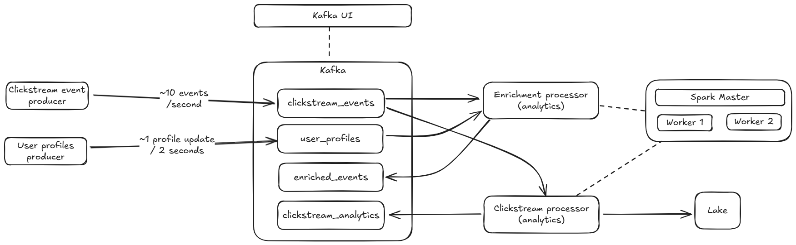
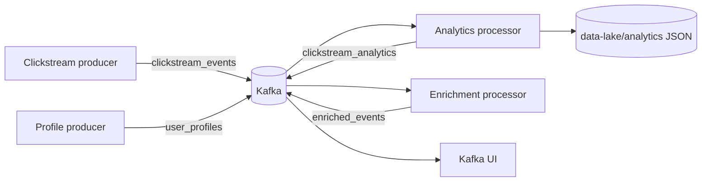

# Real-Time E-Commerce Clickstream Analytics

A local, containerized streaming pipeline that uses Apache Kafka and PySpark Structured Streaming to process simulated e-commerce activity. It demonstrates late data, duplicate delivery, event-time windows, state cleanup, stream-stream joins, checkpoint recovery, and fan-out to Kafka and a JSON data lake.

This repository is a hands-on development and learning environment. Kafka and Spark run in Docker; the two Python producers run on the host and connect to Kafka through `localhost:9092`.



## Architecture



### Components

| Component | Role | Source |
| --- | --- | --- |
| Kafka in KRaft mode | Message broker for raw and derived streams | `docker-compose.yml` |
| Kafka UI | Local browser interface for inspecting topics | `http://localhost:8083` |
| Spark master and workers | Distributed execution for Structured Streaming | `spark.Dockerfile` |
| Analytics processor | Deduplicates events and counts event types in one-minute windows | `clickstream_processor/main.py` |
| Enrichment processor | Joins clickstream events to profile updates by user and event time | `enrich_clickstream/main.py` |
| Clickstream producer | Generates events, late records, and duplicates | `clickstream_producer/main.py` |
| Profile producer | Generates profile updates for eight sample users | `profile_producer/main.py` |

## What It Demonstrates

- **At-least-once input:** the clickstream producer resends recent events with a five percent probability.
- **Late data:** ten percent of clickstream events receive a timestamp 30 to 90 seconds in the past.
- **Stateful deduplication:** analytics uses `dropDuplicatesWithinWatermark(["event_id"])` with a two-minute watermark.
- **Event-time aggregation:** events are grouped by `event_type` in one-minute tumbling windows.
- **Watermarked append output:** finalized windows are emitted after the watermark passes the window.
- **Multi-sink micro-batches:** `foreachBatch` writes analytics records to Kafka and partitioned JSON files.
- **Stream-stream joins:** enrichment joins clicks and profiles on `user_id`, allowing clicks up to ten minutes after a profile update.
- **Recovery and backpressure:** checkpoints are mounted under `spark-checkpoints/`, and analytics limits Kafka input with `maxOffsetsPerTrigger=1000`.

## Prerequisites

- Docker Engine with the Compose plugin
- Python 3.10.20
- [`uv`](https://docs.astral.sh/uv/) for local dependency management
- At least 4 GB of memory available to Docker

The Docker images install the Spark Kafka connector dependencies. The host environment only needs the Python producer dependencies from `pyproject.toml`.

## Quick Start

Run the steps in this order.

### 1. Install Python dependencies

```bash
uv sync
```

### 2. Start Kafka and Spark

```bash
docker compose up -d --build kafka kafka-ui spark-master spark-worker-1 spark-worker-2
```

Create the four topics. `--if-not-exists` makes this safe to repeat.

```bash
for topic in clickstream_events clickstream_analytics user_profiles enriched_events; do
	docker exec kafka kafka-topics \
		--create \
		--if-not-exists \
		--topic "$topic" \
		--bootstrap-server localhost:9092 \
		--partitions 1 \
		--replication-factor 1
done
```

### 3. Start the Spark streaming jobs

Wait until the Spark master and workers are running, then start both jobs:

```bash
docker compose up --build clickstream-processor clickstream-enrichment
```

The jobs run continuously. Stop them with `Ctrl+C`. Spark interfaces are available at:

- Spark master: `http://localhost:8080`
- Spark worker 1: `http://localhost:8081`
- Spark worker 2: `http://localhost:8082`

### 4. Start the producers

Use separate terminals from the repository root:

```bash
uv run python clickstream_producer/main.py
```

```bash
uv run python profile_producer/main.py
```

The clickstream producer emits about ten events per second and the profile producer emits one profile update every two seconds. Both stop cleanly with `Ctrl+C`.

## Inspect the Output

Open Kafka UI at `http://localhost:8083`, or consume records from a terminal:

```bash
docker exec kafka kafka-console-consumer \
	--bootstrap-server localhost:9092 \
	--topic clickstream_analytics \
	--from-beginning
```

```bash
docker exec kafka kafka-console-consumer \
	--bootstrap-server localhost:9092 \
	--topic enriched_events \
	--from-beginning
```

Analytics JSON files are written locally under `data-lake/analytics/`, partitioned by event type:

```text
data-lake/analytics/event_type=page_view/
data-lake/analytics/event_type=add_to_cart/
data-lake/analytics/event_type=purchase/
```

The batch IDs processed by the analytics job are recorded in `data-lake/batch_tracker.txt`. Spark query state and Kafka offsets are stored in `spark-checkpoints/analytics/` and `spark-checkpoints/enriched/`.

## Data Contracts

### Raw clickstream event

Published to `clickstream_events`:

```json
{
	"event_id": "42_7d8...",
	"user_id": "user_3",
	"event_type": "add_to_cart",
	"timestamp": "2026-01-01T12:00:00+00:00",
	"page": "/product/1"
}
```

`event_type` is one of `page_view`, `add_to_cart`, or `purchase`.

### User profile update

Published to `user_profiles`:

```json
{
	"user_id": "user_3",
	"name": "Charlie",
	"segment": "premium",
	"profile_timestamp": "2026-01-01T12:00:00+00:00"
}
```

### Analytics result

Published to `clickstream_analytics` and written to the data lake:

```json
{
	"window_start": "2026-01-01T12:00:00",
	"window_end": "2026-01-01T12:01:00",
	"event_type": "purchase",
	"count": 12
}
```

### Enriched event

Published to `enriched_events` with the original event fields plus `name` and `segment` from the profile stream.

## Configuration Notes

- Analytics starts from Kafka offset `earliest`; enrichment starts from `latest`.
- Both Spark queries use a ten-second processing-time trigger.
- The analytics watermark is two minutes. The enrichment job uses a two-minute click watermark and a five-minute profile watermark.
- Checkpoints are local bind mounts for this demo. Delete them only when intentionally resetting query progress; a restarted query uses existing checkpoints instead of reapplying `startingOffsets`.
- The local Kafka cluster has one broker, one partition per topic, and replication factor one. These settings are for development and are not production availability settings.
- `foreachBatch` keeps a batch ID tracker to avoid reprocessing a completed batch. The Kafka and JSON writes are sequential, so production deployments should use durable, transactional, or otherwise independently idempotent sink designs when atomic cross-sink delivery is required.

## Stop and Reset

Stop the containers while preserving local output and checkpoints:

```bash
docker compose down
```

To reset the demo's accumulated state, stop the stack and remove the contents of `data-lake/` and `spark-checkpoints/` before starting again. This causes the streaming queries to read from their configured starting offsets.

## Project Layout

```text
clickstream_producer/main.py       Generates raw clickstream events
profile_producer/main.py           Generates user profile updates
clickstream_processor/main.py      Windowed analytics and multi-sink writer
enrich_clickstream/main.py         Watermarked stream-stream join
docker-compose.yml                 Kafka, UI, Spark, and job services
clickstream.Dockerfile             Spark job image with Python dependencies
spark.Dockerfile                   Spark image with Kafka connector jars
system-design.excalidraw.png       High-level architecture diagram
data-lake/                         Local analytics output and batch tracker
spark-checkpoints/                 Local Structured Streaming checkpoints
```